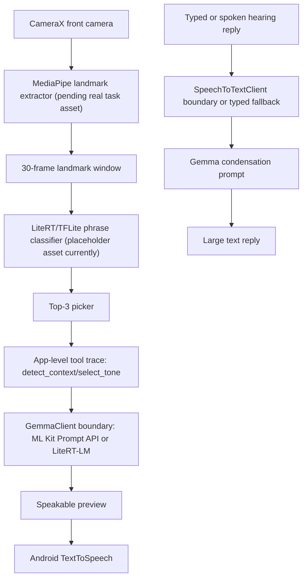

# SignBridge

Offline-first Android MVP for the Gemma 4 Good Hackathon, Digital Equity & Inclusivity track.

SignBridge is scoped to one bounded workflow: a Deaf signer in a stressful Lagos roadside interaction needs a hearing non-signer to understand them quickly, without internet.

## What Works In This Repo

- Native Android app in Kotlin + Jetpack Compose.
- First-run safety disclaimer.
- Home, Emergency, Sign to Speech, Listen, and Settings screens.
- Emergency grid with six large TTS-ready phrases.
- CameraX Sign to Speech shell with push-to-sign state.
- Placeholder classifier integration with top-3 picker.
- Selected phrase -> app-level tool trace -> `GemmaClient` boundary -> speakable preview -> manual Speak action.
- Listen typed-reply fallback with one-sentence condensation.
- Privacy-first settings: auto-speak off, data contribution off, threshold 0.65.
- Test Android Apps emulator QA evidence under `docs/verification/`.

## What Is Still Pending

This is not yet a final hackathon submission build.

- Physical Galaxy S24 Ultra Gate 0: AICore/Gemma 4 runtime must be verified in-app.
- Live ML Kit Prompt API or LiteRT-LM Gemma generation must replace the current deterministic placeholder.
- MediaPipe Holistic `.task` asset and real landmark extraction must be wired.
- The current TFLite classifier file is a valid untrained contract model; a trained classifier must still be exported from real landmark data.
- Offline microphone speech recognition must be verified on the physical phone. Typed reply fallback is implemented.

## Privacy

- No backend.
- No accounts.
- No analytics.
- No crash reporting.
- No network permission.
- Camera and microphone permissions only.
- Raw video/audio are not persisted by default.

## Architecture



## Setup

Requirements:

- Android Studio or Android SDK CLI.
- JDK 17.
- Android emulator or physical Android device.

Commands:

```bash
./gradlew testDebugUnitTest connectedDebugAndroidTest :app:assembleDebug
.venv/bin/pytest ml/tests -q
```

Install debug APK:

```bash
$HOME/Library/Android/sdk/platform-tools/adb install -r app/build/outputs/apk/debug/app-debug.apk
```

## Verification

Key evidence:

- `docs/verification/test-android-apps-qa.md`
- `docs/verification/offline-test-matrix.md`
- `docs/verification/physical-s24-qa.md`
- `docs/verification/gemma-tooling-claim.md`
- `docs/verification/classifier-report.md`

Latest local verification:

- `./gradlew testDebugUnitTest connectedDebugAndroidTest :app:assembleDebug` passed.
- `.venv/bin/pytest ml/tests -q` passed: 12 tests.

## License

Apache 2.0.
